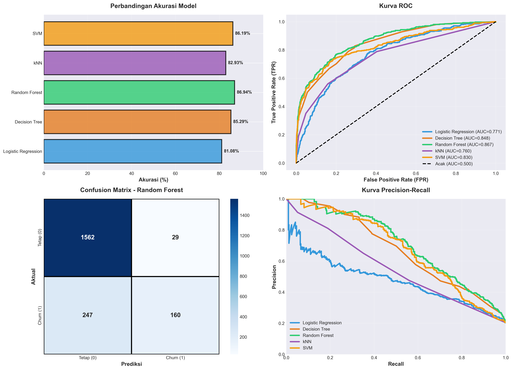

# Customer Churn Prediction

## Overview
Customer churn is a major issue in the banking industry.  
This project builds machine learning models to predict whether a customer will leave the bank based on demographic and financial information.

## Dataset
Bank Customer Churn Dataset  
https://www.kaggle.com/datasets/shantanudhakadd/bank-customer-churn-prediction

- 9990 customer records
- 11 features
- Target: churn (1 = leave, 0 = stay)

Feature types:
- Numerical: credit_score, age, balance, salary, tenure
- Categorical: country, gender, product_number
- Binary: credit_card, active_member

## Methods
Steps performed in this project:

- Data preprocessing
- Exploratory Data Analysis (EDA)
- Train-test split (80:20)
- Feature scaling
- Model training and evaluation

Models tested:
- Logistic Regression
- Decision Tree
- Random Forest
- k-Nearest Neighbors (kNN)
- Support Vector Machine (SVM)

## Results
Random Forest achieved the best performance with the highest accuracy and ROC-AUC score.

## Project Information
Group project – Topik Khusus Sains Data  
Institut Teknologi Bandung

Team members:
- Ashma Nisa Sholihah Adma
- Izzah Huwaidah
